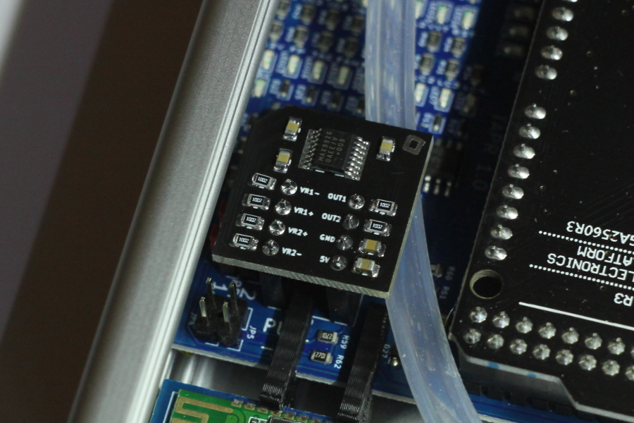

# Dual VR Conditioner minimal 1.1 (not that minimal)

This board translates the differential signals from up to two inductive engine speed/position sensors into clean output pulses required by Speeduino and other stand-alone ECUs. The pinout of this module matches the VR socket on Speeduino boards.

Heart of this dual VR conditioner is the Maxim MAX9926 variable reluctance sensor interface. The circuit is a very close representation of the reference designs shown in the MAX9924-MAX9927 and MAX9926U evaluation kit [datasheets](Resources) (thus nearly identical to the [Dual VR Conditioner](https://github.com/noisymime/speeduino/tree/master/reference/hardware/VR%20Conditioner) by Josh Stewart).

This work (with the exception of copies of external resources located in the "Resources" directory) is licensed under a [Creative Commons Attribution-ShareAlike 4.0 International License](https://creativecommons.org/licenses/by-sa/4.0/).
